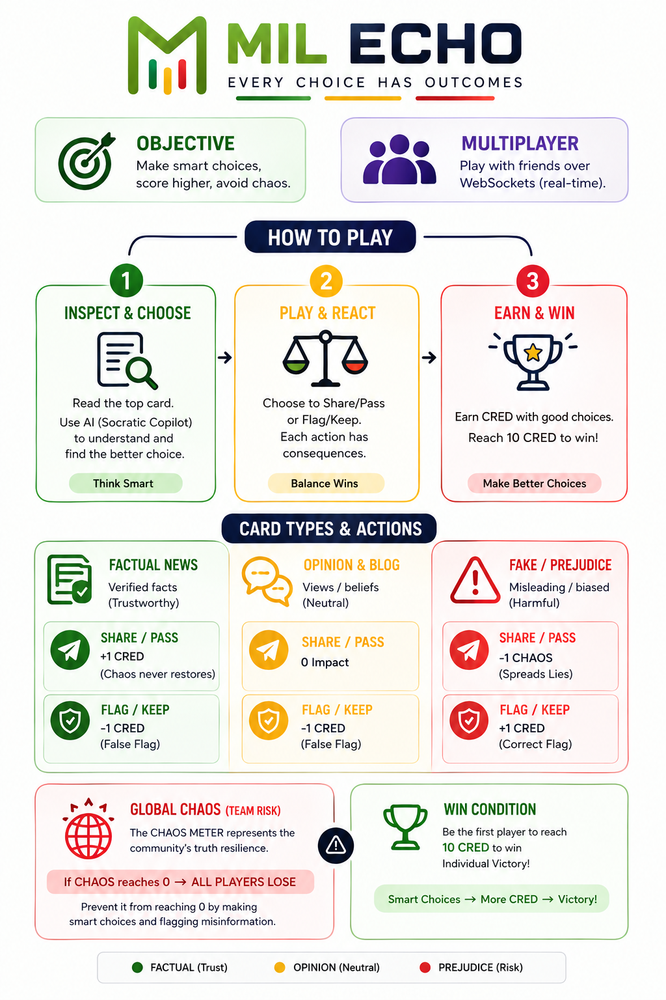

<div align="center">

<!-- MIL ECHO LOGO PLACEHOLDER -->
<a href="https://mil-echo.vercel.app/">
  
</a>

# 🛡️ MIL ECHO — AI-Powered Media & Information Literacy Prebunking Arena

> **EVERY CHOICE HAS OUTCOMES.**  
> An interactive, multiplayer prebunking card game empowering youth to build Media and Information Literacy (MIL) skills. Inspect online news cards, verify information, and experience how your decisions shape community truth resilience. Earn **CRED** through critical thinking and work together to stop **CHAOS** before it reaches zero!

[](https://mil-echo.vercel.app/)
[-0070F3?style=for-the-badge&logo=render&logoColor=white)](https://mil-echo.onrender.com/health)
[](LICENSE)
[](https://github.com/Ruchit0807/MIL-ECHO)

---

<!-- PRODUCT TUTORIAL VIDEO PLACEHOLDER -->
### 🎬 Product Demo & Video Walkthrough

[](https://youtu.be/Z0CzOlkPQGY "Watch MIL ECHO Video Guide")

> 💡 **Watch the 60-Second Video Tutorial**: [Click here to watch on YouTube](https://youtu.be/Z0CzOlkPQGY)

<!-- 
===================================================================
PRODUCT TUTORIAL VIDEO PLACEHOLDER (CUSTOM UPLOAD SPACE):
Uncomment and replace the video URL below when uploading your MP4/WebM video:
===================================================================
<video src="YOUR_UPLOADED_VIDEO_PATH_HERE.mp4" width="100%" controls poster="apps/web-client/public/how_to_play_infographic.png"></video>
-->

---

</div>

## 🌟 Overview & Mission

In an era dominated by rapid information streams, viral algorithms, and synthetic AI content, youth face an unprecedented flood of unverified news and deepfakes. **MIL ECHO** bridges the gap between digital entertainment and educational prebunking.

Built for the **UNESCO Youth Hackathon 2026**, MIL ECHO turns critical thinking into a high-stakes multiplayer arena. Players learn to analyze incoming media, identify emotional triggers and biases, collaborate with a **Socratic AI Prebunking Copilot**, and protect their community from descending into systemic misinformation **CHAOS**.

---

## 🏛️ UNESCO 5 Laws of Media & Information Literacy (MIL)

MIL ECHO natively embeds the **UNESCO 5 MIL Laws** directly into gameplay actions:

| UNESCO Law | Core Principle | In-Game Integration |
| :--- | :--- | :--- |
| **Law 1: Equal Status & Engagement** | All information providers (media, internet, libraries) are equal for critical engagement. | Socratic AI evaluates all media formats (text, audio, video, deepfakes) equally. |
| **Law 2: Citizen Empowerment** | Every citizen is a creator; MIL is for ALL regardless of background. | Supports 2–6 player lobbies and printable offline PDF decks for low-tech regions. |
| **Law 3: Transparency of Biases** | Information is never value-neutral; it always carries intent and bias. | Cards display 3C2B metrics (Creator, Content, Context, Bias, Business/Behavior). |
| **Law 4: Universal Right to Information** | Citizens have the right to seek, receive, and impart true information. | Sharing verified facts earns +1 CRED and protects the community. |
| **Law 5: Lifelong Dynamic Process** | MIL is a continuous, evolving practice, not a one-time test. | Dynamic Socratic prompts encourage reflective questioning over binary answers. |

---

## 🎮 Key Game Mechanics & Scoring System

<div align="center">
  
</div>

### 🏆 Winning & Survival Conditions
- 💎 **Individual Victory (Reach 10 CRED)**: The first player to accumulate **10 CRED** points through smart truth-sharing and accurate misinformation flagging wins individually.
- 🔥 **Global CHAOS Meter (Irreversible)**: Measures community truth resilience. Sharing fake news drops CHAOS. **CHAOS can NEVER be restored!** If the CHAOS meter hits **0**, **EVERYONE LOSES!**

### 🃏 Card Types & Tactical Actions

| Card Category | Impact of SHARING 📤 | Impact of FLAGGING 🛡️ | Strategic Guidance |
| :--- | :--- | :--- | :--- |
| 🟩 **Factual News** | **+1 CRED** (Chaos remains stable) | **-1 CRED** (False Flag penalty) | High credibility. Share to build individual CRED score. |
| 🟪 **Opinion & Blog** | **0 Impact** (Neutral) | **-1 CRED** (False Flag penalty) | Subjective editorials. Discard safely to keep hand clean. |
| 🟥 **Fake / Prejudice** | **-1 CHAOS** (Spreads lies) | **+1 CRED** (Correct Flag reward) | Misleading content. Flag it to gain CRED and protect CHAOS. |
| 🤖 **AI Deepfakes** | **-1 CHAOS** (Triggers viral risk) | **+1 CRED** (Detects synthetic media) | Audio voice clones, video lip-syncs & forged web portals. |

### ⚡ Power Move: Mega Cascade
When holding a highly prejudiced or controversial card, players can trigger a **Mega Cascade Move**! This replicates the card and pushes copies to all active players' inboxes simultaneously, testing the entire room's verification speed.

---

## 🏗️ Core Pillars & Technical Capabilities

- 🎮 **Real-Time Synchronized Engine**: Fast WebSocket state synchronization powered by FastAPI handles room creation (2–6 players), turn switching, real-time chats, and win checks.
- 🧠 **3C2B Socratic AI Prebunking Copilot**: Powered by **Mistral AI (`mistral-small-2603`)** with **Gemini 2.5 Flash** fallback & **Tavily Web Search**. Analyzes headlines using Creator, Content, Context, Bias, and Business/Behavior metrics. *Guides users with reflective questions rather than plain True/False answers.*
- 🧩 **Chrome Extension Companion**: A Manifest V3 Chrome Extension (`apps/browser-extension`) allowing users to capture live web headlines while browsing and push them into their in-game Extension Inbox deck.
- 🖨️ **Printable Offline PDF Deck Generator**: Includes a Python PDF generator script (`packages/pdf-generator`) powered by ReportLab to export physical card decks for offline classroom sessions in low-connectivity areas.
- 🎨 **Neo-Brutalist High-Impact UI**: Responsive, accessible web design built with Next.js 14, Tailwind CSS, Framer Motion, and custom retro-cyber theme tokens.

---

## 📐 System Architecture

```mermaid
graph TD
    subgraph Frontend_Client["Frontend Client (Vercel Deployment)"]
        UI["Next.js 14 React Web App"] <-->|WebSockets & REST| WS_C["WS State Manager"]
        Ext["Chrome Extension (Manifest V3)"] -->|Local Storage Bridge| UI
    end

    subgraph Backend_Microservice["Backend Microservice (Render Deployment)"]
        WS_C <-->|/ws/room/{code}| FastAPI["FastAPI Server (main.py)"]
        FastAPI <--> Engine["Python Game Engine"]
        FastAPI <--> SocEngine["Socratic AI Engine"]
    end

    subgraph External_AI_Services["External AI & Fact APIs"]
        SocEngine <-->|Primary LLM| Mistral["Mistral AI (mistral-small-2603)"]
        SocEngine <-->|Fallback LLM| Gemini["Google Gemini 2.5 Flash"]
        SocEngine <-->|Real-Time Fact Context| Tavily["Tavily Web Search API"]
    end
```

---

## 📂 Monorepo Repository Structure

```
mil-echo-root/
├── apps/
│   ├── web-client/                  # Next.js 14 Web Application
│   │   ├── public/                  # Assets (Logos, Infographics, Icons)
│   │   │   ├── mil_logo.png         # Main Logo
│   │   │   ├── unesco_logo.jpeg     # UNESCO Logo
│   │   │   └── how_to_play_infographic.png # Gameplay Visual Guide
│   │   ├── src/
│   │   │   ├── components/          # ScoreBoard, CardArena, Modals, Drawers
│   │   │   ├── pages/               # Index, App pages
│   │   │   └── lib/                 # Client engine & cards database
│   │   └── package.json
│   ├── ai-service/                  # FastAPI Python Microservice
│   │   ├── main.py                  # Server entry point & WebSocket hub
│   │   ├── services/                # Socratic AI Engine & DB state
│   │   └── requirements.txt         # Python dependencies
│   └── browser-extension/           # Chrome Extension Companion (Manifest V3)
├── packages/
│   └── pdf-generator/               # ReportLab Printable PDF Deck Generator
├── vercel.json                      # Vercel Production Build Config
├── render.yaml                      # Render Microservice Deployment Config
├── README.md                        # Documentation
└── .env.example                     # Environment Configuration Template
```

---

## 🚀 Live Services & Deployment Links

| Service | Host / Platform | Live Endpoint URL | Status |
| :--- | :--- | :--- | :--- |
| **Web Client Application** | Vercel | [https://mil-echo.vercel.app](https://mil-echo.vercel.app) | 🟢 Operational |
| **AI Microservice API** | Render | [https://mil-echo.onrender.com](https://mil-echo.onrender.com) | 🟢 Operational |
| **API Health Check** | Render | [https://mil-echo.onrender.com/health](https://mil-echo.onrender.com/health) | 🟢 Healthy |
| **GitHub Repository** | GitHub | [https://github.com/Ruchit0807/MIL-ECHO](https://github.com/Ruchit0807/MIL-ECHO) | 🐙 Maintained |

---

## 🛠️ Local Installation & Development Guide

### Prerequisites
- **Node.js**: v18.0+ & `npm`
- **Python**: v3.11+ & `pip`

### 1. Clone the Repository
```bash
git clone https://github.com/Ruchit0807/MIL-ECHO.git
cd MIL-ECHO
```

### 2. Set Up Environment Variables
Copy `.env.example` to `.env`:
```bash
cp .env.example .env
```
Fill in your API keys in `.env`:
```env
PORT=8000
GEMINI_API_KEY=your_gemini_api_key_here
MISTRAL_API_KEY=your_mistral_api_key_here
MISTRAL_MODEL=mistral-small-2603
TAVILY_API_KEY=your_tavily_api_key_here

NEXT_PUBLIC_AI_SERVICE_URL=http://localhost:8000
NEXT_PUBLIC_APP_MODE=hybrid
```

### 3. Launch the Backend (`ai-service`)
```bash
cd apps/ai-service
python -m venv .venv

# On Windows:
.venv\Scripts\activate
# On macOS/Linux:
source .venv/bin/activate

pip install -r requirements.txt
python -m uvicorn main:app --host 127.0.0.1 --port 8000 --reload
```
*Backend runs on `http://127.0.0.1:8000`.*

### 4. Launch the Web Frontend (`web-client`)
In a new terminal window:
```bash
cd apps/web-client
npm install
npm run dev
```
*Frontend runs on `http://localhost:3000`.*

---

## 📡 API Reference & Endpoints

### Health Check
`GET /health`
```json
{
  "status": "healthy",
  "primary_ai_provider": "Mistral AI",
  "mistral_api_configured": true,
  "mistral_model": "mistral-small-2603",
  "tavily_search_configured": true
}
```

### Socratic AI Card Audit
`POST /api/v1/audit-card`
```json
// Request Payload
{
  "headline": "New Solar Battery claims 100x efficiency boost",
  "media_url": "",
  "content": "Category: Technology"
}

// Socratic Response
{
  "creator_analysis": "Headline exhibits sensationalized emotional urgency...",
  "emotional_triggers": ["Awe", "Urgency"],
  "socratic_question": "Before sharing, what independent scientific source would you check to verify this claim?",
  "resilience_score_impact": 15,
  "clout_score_risk": "High"
}
```

### Create Room
`POST /api/v1/rooms`
```json
{
  "host_name": "Initiate Alpha",
  "max_players": 4,
  "starting_chaos": 10,
  "ai_copilot_mode": "Socratic Guidance"
}
```

---

## 📬 Contact & Support

- **Project Lead / Support**: [milecho0812@gmail.com](mailto:milecho0812@gmail.com)
- **UNESCO Youth Hackathon 2026 Project Repository**: [GitHub - Ruchit0807/MIL-ECHO](https://github.com/Ruchit0807/MIL-ECHO)

---

<div align="center">

Distributed under the **MIT License**.  
**MIL ECHO • UNESCO Youth Hackathon 2026**

</div>
